# Brainstorming Ideas Into Designs

Help turn ideas into fully formed designs and specs through natural collaborative dialogue.

Start by understanding the current project context, then ask questions one at a time to refine the idea. Once you understand what you're building, present the design and get user approval.

<HARD-GATE>
Do NOT invoke any implementation skill, write any code, scaffold any project, or take any implementation action until you have presented a design and the user has approved it. This applies to EVERY project regardless of perceived simplicity.
</HARD-GATE>

## Anti-Pattern: "This Is Too Simple To Need A Design"

Every project goes through this process. A todo list, a single-function utility, a config change — all of them. "Simple" projects are where unexamined assumptions cause the most wasted work. The design can be short (a few sentences for truly simple projects), but you MUST present it and get approval.

## Relationship to Let Fate Decide

`brainstorming` owns the front door for ambiguous creative work. If the user is loose, playful, or under-specified, stay in brainstorming first: explore context, ask clarifying questions, and shape the decision space.

Do NOT invoke `let-fate-decide` as a substitute for this flow unless the user explicitly asks for Tarot/fate-based guidance.

You MAY offer `let-fate-decide` as an escape hatch after some initial brainstorming when the user is still happily noncommittal and would rather let entropy break the tie than keep refining requirements.

If the user wants that detour, give them the exact transfer prompt in a standalone code block with no prefacing or trailing filler so they can copy it verbatim into a new conversation, then resume the brainstorming session when they return with the reading.

## Checklist

You MUST create a task for each of these items and complete them in order:

1. **Explore project context** — check files, docs, recent commits
2. **Offer visual companion** (if topic will involve visual questions) — this is its own message, not combined with a clarifying question. See the Visual Companion section below.
3. **Ask clarifying questions** — one at a time, understand purpose/constraints/success criteria
4. **Offer `let-fate-decide` only if appropriate** — optional, only after some brainstorming, and only if the user remains intentionally loose or explicitly wants Tarot guidance
5. **Decision Interrogation** — explicitly probe architecture tradeoffs before selecting approach
6. **Propose 2-3 approaches** — with trade-offs and your recommendation
7. **Present design** — in sections scaled to their complexity, get user approval after each section
8. **Write design doc** — save to `docs/superpowers/specs/YYYY-MM-DD-<topic>-design.md` and commit
9. **Spec self-review** — quick inline check for placeholders, contradictions, ambiguity, scope (see below)
10. **User reviews written spec** — ask user to review the spec file before proceeding
11. **Capture user preferences** — identify patterns, philosophies, coding preferences that emerged; get approval before writing to `agents.md`

## Process Flow

```dot
digraph brainstorming {
    "Explore project context" [shape=box];
    "Visual questions ahead?" [shape=diamond];
    "Offer Visual Companion\n(own message, no other content)" [shape=box];
    "Ask clarifying questions" [shape=box];
    "Still intentionally loose?" [shape=diamond];
    "Offer let-fate-decide detour" [shape=box];
    "Decision Interrogation" [shape=box];
    "Propose 2-3 approaches" [shape=box];
    "User approves approach?" [shape=diamond];
    "Present design sections" [shape=box];
    "User approves design?" [shape=diamond];
    "Write design doc" [shape=box];
    "Capture user preferences" [shape=box];
    "User approves AGENTS.md updates?" [shape=diamond];

    "Ask clarifying questions" -> "Still intentionally loose?";
    "Still intentionally loose?" -> "Offer let-fate-decide detour" [label="yes, optional"];
    "Still intentionally loose?" -> "Decision Interrogation" [label="no"];
    "Offer let-fate-decide detour" -> "Decision Interrogation" [label="declined / returned"];
}
```



## Let Fate Decide Detour

Use this sparingly. The goal is not to avoid design work; it is to give a genuinely noncommittal user a structured way to break a tie and then bring the result back into brainstorming.

Only offer this detour when ALL of the following are true:

- You have already done some real brainstorming in the current conversation
- The user is still relaxed about the choice rather than asking for precision
- There are multiple reasonable directions and continued questioning is not buying much
- The user has not said they want to avoid Tarot

Suggested offer during brainstorming:
> "You seem pretty loose on this. Want to let fate decide and come back with a reading?"

If the user says yes, output ONLY this prompt, with the bracketed fields filled in for the current situation:

```text
Use the let-fate-decide skill for this decision.

Context from brainstorming:
- Project/task: <project or feature>
- Decision to break: <the ambiguous choice>
- Options on the table: <option A>; <option B>; <option C if needed>
- Constraints: <hard constraints or 'none beyond normal good judgment'>
- What I need back: a concise reading with the 4 cards, the interpretation, and a recommended direction I can bring back into the brainstorming session

Do not implement anything. Do not continue brainstorming beyond the reading. I am taking the result back to the original brainstorming conversation.
```

When the user comes back with the reading, treat it as input to brainstorming, not as permission to skip the rest of the design flow.

## Decision Interrogation

Before proposing approaches, explicitly interrogate key architecture decisions:

- **Abstraction:** Should this be implemented now or deferred? What is the simplest viable option?
- **Placement:** Where does this belong — service, helper, model, or ViewModel-equivalent role?
- **Dependency approach:** Direct construction or injection?
- **Testing implications:** How will this be tested? What are the test boundaries?
- **Unknowns:** What is NOT yet known that could change the design?

Document the interrogation in your conversation with the user before proceeding to approach selection.

If message includes `OVERRIDE: fast-path`, run condensed flow and explicitly state which decision steps were skipped.

## Capturing User Preferences

After design approval but before writing the design doc, capture any preferences, patterns, or philosophies that emerged during the brainstorming session:

**What to look for:**

- Design philosophies mentioned (e.g., "I like interfaces a lot")
- Coding preferences (e.g., "I prefer stateless methods", "favor explicit error handling")
- Architectural patterns recurring in their feedback
- Anti-patterns they want to avoid

**Approval workflow:**

- Paraphrase bullet points: "Here's what I'm going to add to AGENTS.md after our discussion:"
- Wait for the user's approval
- Don't auto-update without explicit consent

**How to write:**

- Create or update `AGENTS.md` in project root
- Write new entries as bullet points with brief context
- Build a knowledge base over time for future brainstorming sessions

## The Process

**Understanding the idea:**

- Check out the current project state first (files, docs, recent commits)
- Before asking detailed questions, assess scope: if the request describes multiple independent subsystems (e.g., "build a platform with chat, file storage, billing, and analytics"), flag this immediately. Don't spend questions refining details of a project that needs to be decomposed first.
- If the project is too large for a single spec, help the user decompose into sub-projects: what are the independent pieces, how do they relate, what order should they be built? Then brainstorm the first sub-project through the normal design flow. Each sub-project gets its own spec → plan → implementation cycle.
- For appropriately-scoped projects, ask questions one at a time to refine the idea
- If the user is vague or casual, do not jump straight to `let-fate-decide`; brainstorming still owns the flow unless they explicitly want the Tarot detour
- Prefer multiple choice questions when possible, but open-ended is fine too
- Only one question per message - if a topic needs more exploration, break it into multiple questions
- Focus on understanding: purpose, constraints, success criteria

**Exploring approaches:**

- Propose 2-3 different approaches with trade-offs
- Present options conversationally with your recommendation and reasoning
- Lead with your recommended option and explain why

**Presenting the design:**

- Once you believe you understand what you're building, present the design
- Scale each section to its complexity: a few sentences if straightforward, up to 200-300 words if nuanced
- Ask after each section whether it looks right so far
- Cover: architecture, components, data flow, error handling, testing
- Be ready to go back and clarify if something doesn't make sense

## Visual Companion

A browser-based companion for showing mockups, diagrams, and visual options during brainstorming. Available as a tool — not a mode. Accepting the companion means it's available for questions that benefit from visual treatment; it does NOT mean every question goes through the browser.

**Offering the companion:** When you anticipate that upcoming questions will involve visual content (mockups, layouts, diagrams), offer it once for consent:
> "Some of what we're working on might be easier to explain if I can show it to you in a web browser. I can put together mockups, diagrams, comparisons, and other visuals as we go. This feature is still new and can be token-intensive. Want to try it? (Requires opening a local URL)"

**This offer MUST be its own message.** Do not combine it with clarifying questions, context summaries, or any other content. The message should contain ONLY the offer above and nothing else. Wait for the user's response before continuing. If they decline, proceed with text-only brainstorming.

**Per-question decision:** Even after the user accepts, decide FOR EACH QUESTION whether to use the browser or the terminal. The test: **would the user understand this better by seeing it than reading it?**

- **Use the browser** for content that IS visual — mockups, wireframes, layout comparisons, architecture diagrams, side-by-side visual designs
- **Use the terminal** for content that is text — requirements questions, conceptual choices, tradeoff lists, A/B/C/D text options, scope decisions

A question about a UI topic is not automatically a visual question. "What does personality mean in this context?" is a conceptual question — use the terminal. "Which wizard layout works better?" is a visual question — use the browser.

If they agree to the companion, read the detailed guide before proceeding: `skills/brainstorming/visual-companion.md`

## After the Design

**Documentation:**

- Use elements-of-style:writing-clearly-and-concisely skill if available
- Commit the design document to git

**Spec Self-Review:**
After writing the spec document, look at it with fresh eyes:

1. **Placeholder scan:** Any "TBD", "TODO", incomplete sections, or vague requirements? Fix them.
2. **Internal consistency:** Do any sections contradict each other? Does the architecture match the feature descriptions?
3. **Scope check:** Is this focused enough for a single implementation plan, or does it need decomposition?
4. **Ambiguity check:** Could any requirement be interpreted two different ways? If so, pick one and make it explicit.

Fix any issues inline. No need to re-review — just fix and move on.

**User Review Gate:**
After the spec review loop passes, ask the user to review the written spec before proceeding:

> "Spec written and committed to `<path>`. Please review it and let me know if you want to make any changes before we start writing out the implementation plan."

Wait for the user's response. If they request changes, make them and re-run the spec review loop. Only proceed once the user approves.

## Key Principles

- **One question at a time** - Don't overwhelm with multiple questions
- **Multiple choice preferred** - Easier to answer than open-ended when possible
- **YAGNI ruthlessly** - Remove unnecessary features from all designs
- **Explore alternatives** - Always propose 2-3 approaches before settling
- **Incremental validation** - Present design, get approval before moving on
- **Be flexible** - Go back and clarify when something doesn't make sense
