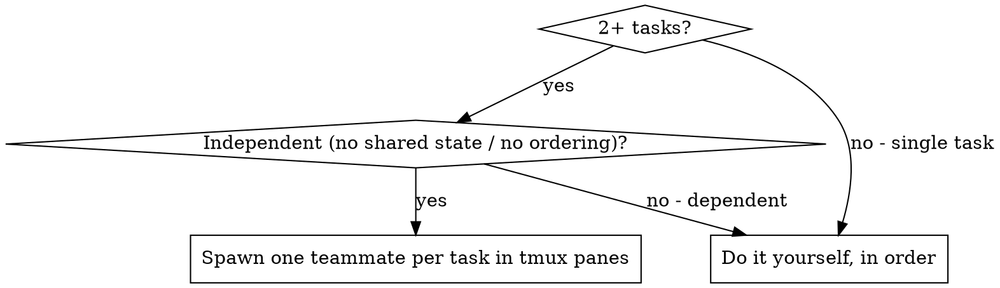

# Dispatching Parallel Agents (ultracode tmux teammates)

## Overview

For **any 2+ independent tasks**, always spawn persistent, interactive **teammates** in
tmux split panes — never run them sequentially yourself and never fall back to one-shot
dropdown subagents. This is the ultracode dynamic workflow: you are the **lead**, you
orchestrate a live team, and each teammate is a full Claude Code instance with its own
context and its own git worktree, visible in its own pane.

This is enabled in the environment already:
- `CLAUDE_CODE_EXPERIMENTAL_AGENT_TEAMS=1`
- `"teammateMode": "tmux"` in settings.json

**Core principle:** One teammate per independent task. They work concurrently in their
own panes. You coordinate through a shared task list and a mailbox.

## When to Use

**Always** when there are 2+ independent tasks — even small ones. If two things can be
done without shared state or a sequential dependency, split them into two tmux panes.



**Don't split when:**
- It's a single task
- Tasks are sequential (output of one feeds the next)
- Tasks edit the same files / share mutable state (they'll conflict)

## The Workflow

### 1. Decompose into independent tracks

Break the work into tracks that touch disjoint files/subsystems. Each track becomes one
teammate. Name them by role so the panes are legible: `research-redis`, `scout-infra`,
`builder-ingest`, etc.

### 2. Spawn teammates into tmux panes

You are the lead. Spawn one teammate per track. Each teammate:
- Runs in its **own tmux split pane** (forced by `teammateMode: tmux`)
- Gets its **own git worktree** so edits never collide
- Has its **own fresh context** — it does NOT inherit your history

Construct exactly the context each teammate needs. They never see your session history,
so paste in the specific files, errors, schema, and constraints they require.

**How to spawn (the mechanics that actually produce a live teammate):** use the
`Agent` tool with a `name` (this makes it a tmux teammate, addressable via
`SendMessage({to: name})`). Two settings are load-bearing — get them wrong and the
"teammate" silently misbehaves:

- **Do NOT set `run_in_background: true`.** That routes the spawn to a one-shot
  background subagent (a dropdown agent), *not* a live tmux pane. Omit it to get a
  real teammate in a pane.
- **Tell the teammate, in its prompt, to `SendMessage` the lead with its result** —
  e.g. *"When done, SendMessage to 'team-lead' with your findings; you MUST
  SendMessage, not just print."* A teammate that only prints its answer dies in its
  pane and you never receive it. The report must come back over the mailbox.

If a "teammate" never reports and isn't visibly progressing, it likely spawned as a
background agent or wasn't told to message back — kill the pane
(`tmux kill-pane -t %<id>`, find it via `tmux list-panes -a`) and re-spawn it
correctly (named, no `run_in_background`, with an explicit SendMessage instruction).

### 3. Coordinate via shared task list + mailbox

- **Shared task list:** the single source of truth for who owns what and task state
  (pending / in progress / completed) and dependencies. Keep it updated as the lead.
- **Mailbox / messaging:** teammates message each other and you peer-to-peer. Use it to
  hand off, unblock, and reconcile. Teammates idle-notify you when they finish or block.
- Only the lead spawns teammates; teammates cannot spawn their own sub-teams.

### 4. Review and integrate

When teammates report back:
- Read each summary in its pane
- Check for cross-worktree conflicts before merging
- Run the full test suite on the integrated result
- Spot-check — parallel teammates can make correlated mistakes

## Teammate Prompt Structure

Each teammate prompt must be:
1. **Focused** — one track, disjoint from the others
2. **Self-contained** — all context it needs, because it sees none of your history
3. **Explicit about output** — what report/artifact it returns, and where it writes
   files, **and an explicit instruction to `SendMessage` the lead when done or
   blocked** (a teammate that only prints never reports back)
4. **Constrained** — which files it owns; what it must NOT touch (other teammates' files)

```markdown
ROLE: builder-ingest

You own the raw-data ingestion path ONLY. Do not touch the schema files
(owned by teammate `schema`) or the retrieval path (owned by `builder-retrieve`).

CONTEXT (you have no prior history — this is everything you need):
<paste the exact schema, file paths, constraints, acceptance criteria>

TASK:
1. <step>
2. <step>

OUTPUT: A findings/changes report. Write code only under src/ingest/.
Message the lead when done or blocked.
```

## Common Mistakes

**❌ Doing 2 independent tasks yourself, sequentially** — split them into panes.
**❌ One-shot dropdown subagents for multi-step dev** — use live teammates instead.
**❌ Leaking your context** — teammates start fresh; construct exactly what they need.
**❌ Overlapping file ownership** — assign disjoint files/worktrees or they'll conflict.
**❌ Vague output spec** — say what report and which files each teammate produces.

## Constraints (version-specific, as of CC 2.1.185)

- Agent Teams is experimental; gated by `CLAUDE_CODE_EXPERIMENTAL_AGENT_TEAMS=1`.
- `teammateMode: tmux` forces split panes (auto-detects tmux vs iTerm2).
- Only the lead runs a team; teammates can't spawn sub-teams.
- Token usage scales ~linearly with team size (~5x for a team of 5) — size the team to
  the number of genuinely independent tracks, not more.
- There is **no dedicated built-in "fan-out" utility** in this version. Parallel work is
  this teammate workflow (preferred), or a shell loop of `claude -p` for bulk per-file
  jobs. `ultrareview` is a cloud multi-agent code review, not a general fan-out tool.

## Verification

After teammates return:
1. Review each teammate's summary
2. Check for conflicts across worktrees before merge
3. Run the full test suite on the integrated tree
4. Spot-check for correlated errors
