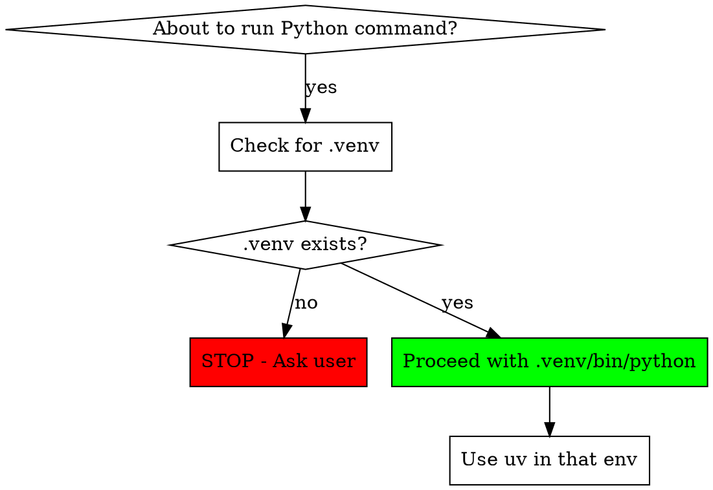

# Managing Python Environments

## Overview

**This is a HARD STOP rule. No exceptions. No rationalizations.**

The user has a specific uv-based Python workflow: environments are created in ~/env/ and symlinked to project directories as .venv. You MUST respect this workflow exactly - never assume, never use system Python, never use pip with --break-system-packages.

**Core principle:** If .venv doesn't exist, you STOP and ask. You do not proceed. You do not guess.

## The Iron Law

```
NO .venv → STOP → ASK USER
```

This applies to:
- Installing packages (pip install, uv pip install, conda install)
- Running Python scripts (python script.py, ./script.py)
- Running Python interpreters (python, python3, ipython)
- Importing Python modules in any context
- Any command that invokes Python

**No exceptions:**
- Not for "just one package"
- Not for "it's urgent"  
- Not for "I know what I'm doing" (user authority)
- Not for "it's temporary"
- Not for "I'll clean up after"
- Not for testing or debugging

## When to Use

**ALWAYS check before ANY Python operation:**



## The Workflow

### Step 1: Check for .venv

Before ANY Python command:

```bash
ls -la .venv 2>&1
```

### Step 2: If NO .venv → STOP

**CRITICAL: You do NOTHING until user responds.**

**You do NOT:**
- ❌ Assume "base" is fine (NEVER assume "base" - there is no default)
- ❌ Pick ANY environment for the user (not base, not ml, not web - NONE)
- ❌ Create a new environment without asking
- ❌ Create the project directory if it doesn't exist
- ❌ Proceed with system Python
- ❌ Use pip with --break-system-packages (EVER)
- ❌ Think "it's just temporary"
- ❌ Think "I'll just do it this once"
- ❌ Proceed while waiting for user response

**You DO:**
- ✅ STOP immediately - do not run ANY commands
- ✅ Check what exists: `ls ~/env/` to show available options
- ✅ Ask user: "There's no .venv in [directory]. How would you like to set up the environment?"
- ✅ WAIT for user response (do not proceed)
- ✅ Present options:
  1. Symlink existing env from ~/env/
  2. Create new uv environment in ~/env/ and symlink it  
  3. Different approach user specifies
- ✅ Only proceed AFTER user explicitly tells you which option

### Step 3: If .venv EXISTS → Verify and Use

Check that .venv is actually a valid environment:

```bash
ls .venv/bin/python 2>&1
```

Then use it for ALL Python operations:

```bash
# Always use the venv Python
.venv/bin/python script.py

# Use uv WITHIN the venv
.venv/bin/python -m uv pip install package_name
# OR activate and use:
source .venv/bin/activate && uv pip install package_name
```

**NEVER use system pip or python directly.**

## Red Flags - STOP and Ask Immediately

**These thoughts mean you're violating the rule - STOP:**

| Thought | Why It's Wrong |
|---------|---------------|
| "base is a good default" | **THERE IS NO DEFAULT.** "base" is just one of many envs. Never assume. |
| "base usually works" | "Usually" = "sometimes wrong." Ask every time. |
| "I'll use base this time" | **NO.** Never pick for the user. |
| "base is common so it must be right" | **WRONG.** You don't know the user's intent. |
| "I'll just pick one" | Violates user's explicit workflow. |
| "It's urgent" | Breaking system Python causes MORE delays. |
| "Just one package" | No exceptions means no exceptions. |
| "The user said to" | User may not realize .venv is missing. Remind them. |
| "I'll use --break-system-packages" | **NEVER. EVER.** |
| "I'll create the directory" | Don't create files/dirs without explicit permission. |
| "I've already started" | Sunk cost fallacy. Stop now. |
| "The user knows what they're doing" | They may have forgotten. Your job is to enforce this. |
| "I already checked earlier" | Check EVERY time before Python commands. |

## Common Rationalizations (All Wrong - Do Not Use)

| Excuse | Reality |
|--------|---------|
| "base is usually fine" | **Usually ≠ always. There is NO default. Ask.** |
| "base is the default" | **There is NO default environment. Never assume.** |
| "I'll use base and tell the user" | **NO.** You must ask BEFORE doing anything. |
| "base is the most common" | **Irrelevant.** You don't pick. The user picks. |
| "The user didn't complain before" | They shouldn't have to. Follow the rule. |
| "It's just for testing" | Testing requires environments too. |
| "I'll set it up the right way after" | No. Do it right from the start. |
| "The directory doesn't exist yet" | Don't create it. Ask user first. |
| "pip install --break-system-packages works" | **NEVER** - this flag is forbidden. |
| "uv doesn't need a venv" | User's workflow requires it. Respect their setup. |
| "This is a one-time thing" | One time creates bad habits. |
| "I need to do something while waiting" | **NO.** Wait for user. Do not proceed. |

## What To Say To User

When .venv is missing, ask:

```
I need to set up the Python environment before proceeding. I don't see a .venv in [directory].

You have these uv environments available in ~/env/:
- [list from ls ~/env/]

How would you like to proceed?
1. Symlink one of the existing environments (e.g., ln -s ~/env/NAME .venv)
2. Create a new uv environment (e.g., uv venv ~/env/NEWNAME --python 3.12)
3. Something else?

Please let me know and I'll set it up before running any Python commands.
```

## Examples

### ❌ WRONG - Never Do This

```bash
# Running without checking
pip install numpy

# Using system packages flag
pip install --break-system-packages requests

# Assuming base is fine
ln -s ~/env/base .venv && .venv/bin/python -m uv pip install flask

# Creating directories without asking
mkdir -p /tmp/new-project && cd /tmp/new-project && uv venv .venv

# Bypassing the check
python3 script.py  # without checking .venv first
```

### ✅ CORRECT - Always Do This

```bash
# Step 1: Always check first
ls -la .venv 2>&1 || echo "No .venv found"

# Step 2: If missing, STOP and ask user
# "No .venv found. How would you like to set up the environment?"

# Step 3: Once user specifies, set it up
ln -s ~/env/ml-project .venv

# Step 4: Use the environment for everything
.venv/bin/python -m uv pip install numpy pandas
.venv/bin/python script.py
```

## The Checklist

Before ANY Python operation:

- [ ] Check if .venv exists: `ls .venv 2>&1`
- [ ] If NO .venv → STOP and ask user
- [ ] If YES .venv → Verify: `ls .venv/bin/python 2>&1`
- [ ] Use `.venv/bin/python` for all Python execution
- [ ] Use `.venv/bin/python -m uv pip` for package management
- [ ] NEVER use system python/pip
- [ ] NEVER use --break-system-packages flag
- [ ] NEVER assume which environment to use
- [ ] NEVER create directories without explicit permission

## Why This Matters

The user's workflow ensures:
1. **Reproducibility**: Every project has its own environment
2. **Clean system Python**: No pollution of system packages
3. **Fast setup**: uv is faster than pip
4. **Organization**: All envs in one place (~/env/)
5. **Flexibility**: Easy to switch between envs per project

Violating this workflow breaks all these benefits.

## Remember

**Violating the letter of this rule is violating the spirit of this rule.**

There are no "special cases." There are no "just this once." There is only:

```
Check .venv → No? STOP → Ask user → Wait → Set up → Proceed
```

**When in doubt: STOP and ask.**