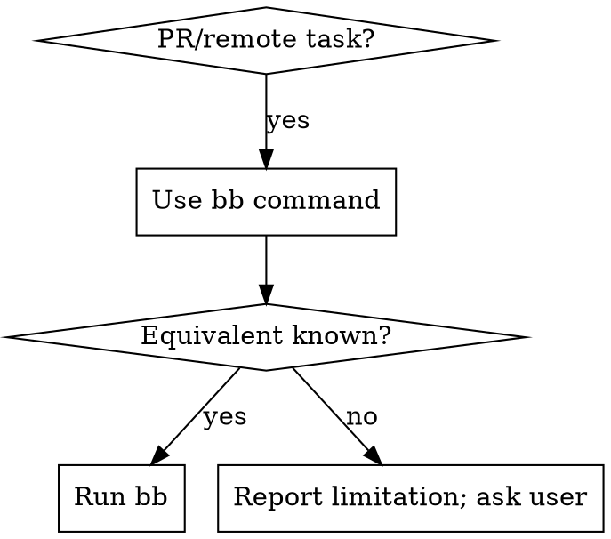

# using-bb-instead-of-gh

## Overview

For PR and remote/repository-hosting workflows, use `bb` and do not use `gh`.
This skill is platform agnostic: it defines behavior, not agent-specific tooling.

## Hard Rule

- `gh` is banned for PR/remote workflows.
- `bb` is the required CLI for these tasks.
- If a `bb` equivalent is unknown, do not switch to `gh`; report the limitation and ask the user.

## When to Use

Use this skill when the task includes any of:

- PR status/details/review checks
- PR comments, approvals, change requests, merges
- PR creation workflows
- Any instruction that would normally trigger `gh`
- Any mention of "remote" Bitbucket/Git hosting operations

## Decision Flow

## bb Quick Reference

Start here:

- `bb --help`
- `bb pr --help`

Authentication:

- `bb auth save`
- `bb auth show`

PR discovery and inspection (default flow):

- `bb pr list`
- `bb pr show <pr_id> [unresolved]` (primary PR status/details command)
- `bb pr diff <pr_id>`
- `bb pr files <pr_id>`
- `bb pr commits <pr_id>`

Common PR actions:

- `bb pr approve <pr_id>`
- `bb pr no-approve <pr_id>`
- `bb pr request-changes <pr_id>`
- `bb pr no-request-changes <pr_id>`
- `bb pr decline <pr_id>`
- `bb pr merge <pr_id>`
- `bb pr create`

Global option:

- `--project <repo>` for selecting repository context

## Verified Behavior Notes

- `bb pr show` without an ID errors with usage requiring `<pr_id>`.
- `bb pr list` provides PR IDs needed for `bb pr show <pr_id>`.

## Common Mistakes

- Using `gh` out of habit -> Replace with `bb` equivalent.
- Calling `bb pr show` without a PR ID -> Run `bb pr list`, then retry with ID.
- Falling back to `gh` when unsure -> Do not fallback; surface limitation and ask the user.
