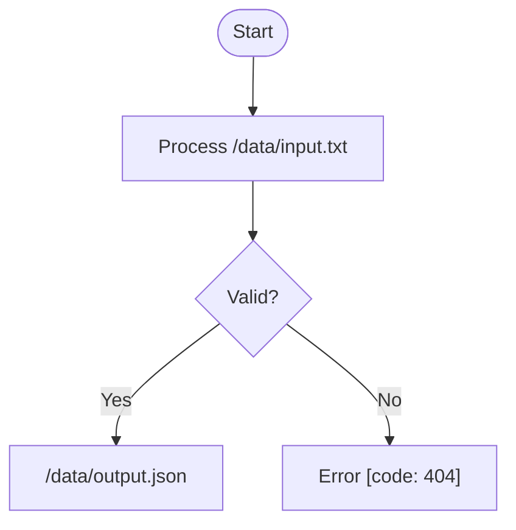
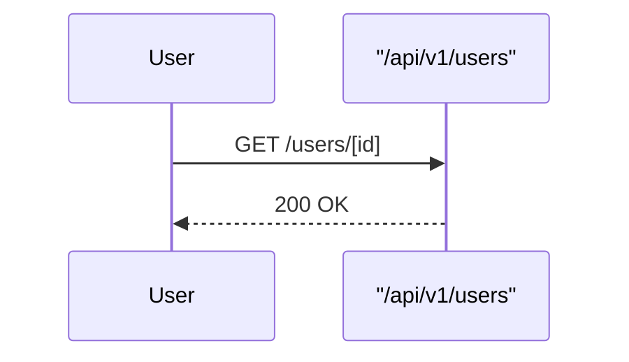
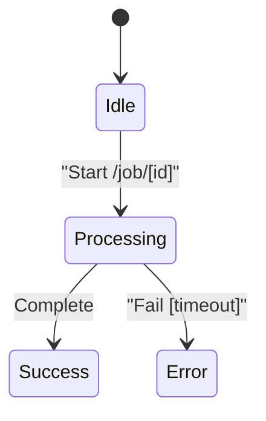
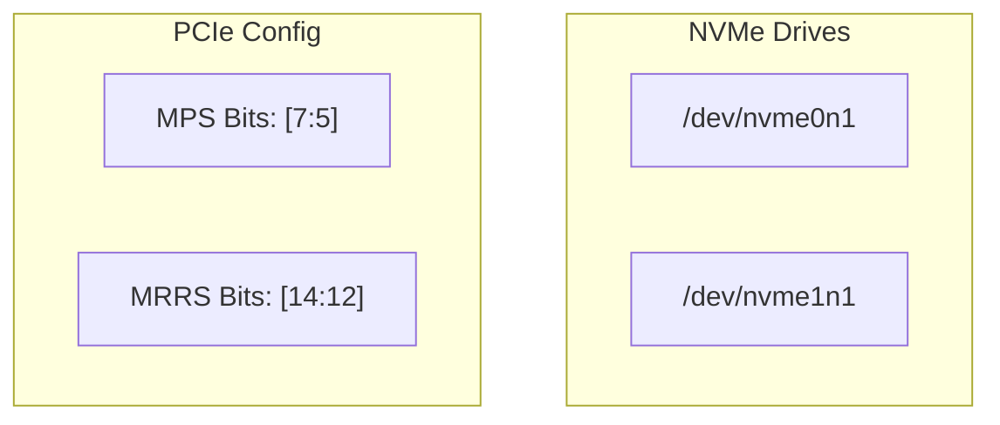

# Writing Mermaid Diagrams

## Overview

Mermaid diagram syntax has strict parsing rules that cause cryptic errors when special characters appear in node labels. Always quote node text containing forward slashes, square brackets, or other special characters.

## When to Use

- Creating flowcharts, sequence diagrams, state diagrams, or other mermaid charts
- Node labels contain file paths (`/dev/nvme0n1`)
- Node labels contain array notation (`[7:5]`, `[0]`)
- Node labels contain special characters (`<`, `>`, `&`, quotes)
- Debugging mermaid parse errors

## Core Rules

### Node Labels Must Be Quoted When Containing Special Characters

**Forward slashes** in file paths:
```mermaid
flowchart LR
    ❌ Drive1[/dev/nvme0n1]           # Parses / as shape syntax
    ✅ Drive1["/dev/nvme0n1"]          # Quotes protect the content
```

**Square brackets** in technical notation:
```mermaid
flowchart TD
    ❌ MPS_Bits[MPS Bits: [7:5]]       # Nested brackets confuse parser
    ✅ MPS_Bits["MPS Bits: [7:5]"]      # Quotes required
```

**Multiple special characters** combined:
```mermaid
flowchart LR
    ❌ Node[Check /proc/[pid]/status]   # Slashes AND brackets
    ✅ Node["Check /proc/[pid]/status"] # Always quote mixed content
```

### Quote Rules by Character Type

| Character | Requires Quotes | Example |
|-----------|----------------|---------|
| Forward slash `/` | Yes | `"/dev/nvme0n1"` |
| Square bracket `[` or `]` | Yes | `"Array[0]"` |
| Double quote `"` | Yes (escape inner) | `"Say \"hello\""` |
| Angle bracket `<` or `>` | Sometimes | `"<tag>"` |
| Ampersand `&` | Sometimes | `"A & B"` |
| Parentheses `()` | No | `Node(label)` |
| Curly braces `{}` | No | `Node{label}` |

**When in doubt, quote it.**

## Common Errors and Fixes

| Error Message | Cause | Fix |
|--------------|-------|-----|
| `Lexical error on line X` | Special chars in node text | Quote the node label |
| `Expecting 'SQE', got 'SQS'` | Nested brackets | Wrap entire label in quotes |
| `Parse error on line X` | Unescaped quotes | Escape with backslash: `\"` |
| `Unrecognized text` | Reserved word as label | Quote the text |

## Diagram Type Quick Reference

### Flowchart (flowchart TB/LR/RL/BT)


### Sequence Diagram


### State Diagram


## Red Flags - Check Your Syntax

- File paths in node labels (`/home/user/file.txt`)
- Array indices or bit ranges (`[7:5]`, `[0]`)
- URLs or API endpoints (`https://api.example.com/v1`)
- Code snippets with brackets or quotes
- JSON or XML with angle brackets

**All of these REQUIRE quotes around the node text.**

## Testing Mermaid Diagrams

Before finalizing, verify your mermaid renders correctly:

1. Check for parse errors in node labels
2. Ensure special characters are quoted
3. Verify arrows (`-->`) connect properly
4. Confirm subgraph syntax uses quotes if needed

**No exceptions:** Even "simple" labels with paths or brackets must be quoted to avoid ambiguous parse errors.

## Example: Complete Fix

**Before (broken):**
```mermaid
flowchart TB
    subgraph Drives["NVMe Drives"]
        D1[/dev/nvme0n1]
        D2[/dev/nvme1n1]
    end
    
    subgraph PCIe["PCIe Config"]
        MPS[MPS Bits: [7:5]]
        MRRS[MRRS Bits: [14:12]]
    end
```

**After (fixed):**

